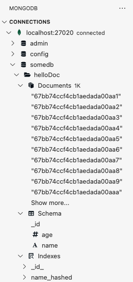

# pymongo-api с шардированным MongoDB с 3мя репликами

## Как запустить

В текущей директории (`./mongo-sharding/`) подготовлен файл `compose.yaml`.

1. Запустить саму базу через compose.

Запускаем mongodb и приложение

```shell
docker compose up -d
```

2. Объединяем всю БД в систему (роутер, сервер конфигурации и шарды 1 и 2) и заполняем mongodb данными

```shell
./scripts/mongo-init.sh
```

Если у Вас возникла проблема (не полного чтения скрипта), то вероятно стоит вручную сделать сброс коллекции в БД:

```shell
docker compose exec -T mongos_router mongosh --port 27020
> use somedb;
> db.helloDoc.countDocuments(); # Должно быть "0". У меня бывало 2000+
> db.helloDoc.drop();

> db.helloDoc.countDocuments(); # Теперь должно быть "0"
> quit();
```

## Как проверить

### На локальной машине

Откройте в браузере `http://localhost:8080/docs`

Первый запрос к коллекции `helloDoc/users` длится более ±1 секунды. Второй и последующие менее 50 мс (у меня 12 мс)

### Если вы запускаете проект на предоставленной виртуальной машине

Узнать белый ip виртуальной машины

```shell
curl --silent http://ifconfig.me
```

Откройте в браузере http://<ip виртуальной машины>:8080

### MongoDB Compass

1. Установить клиент MongoDB Compass.
2. Указать адрес соединения: `mongodb://localhost:27020`
3. Присоединиться и посмотреть коллекцию




## Доступные эндпоинты

Список доступных эндпоинтов, swagger http://<ip виртуальной машины>:8080/docs